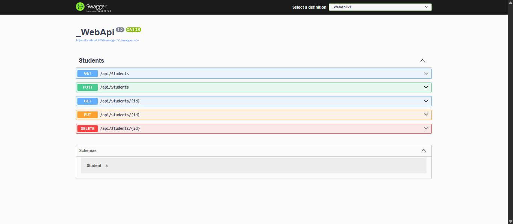

# Students API

A RESTful Web API built with ASP.NET Core for managing student records. This API provides full CRUD (Create, Read, Update, Delete) operations for student data.

## Features

- **GET**: Retrieve all students or a specific student by ID
- **POST**: Create a new student record
- **PUT**: Update an existing student record
- **DELETE**: Remove a student record
- **Entity Framework Core**: Database operations with async/await pattern
- **Swagger Integration**: Interactive API documentation and testing

## Technology Stack

- **Framework**: ASP.NET Core
- **ORM**: Entity Framework Core
- **Database**: SQL Server (via PracticeWebAppContext)
- **Documentation**: Swagger/OpenAPI
- **Language**: C#

## API Endpoints

### Base URL
```
/api/students
```

### Endpoints Overview

| Method | Endpoint | Description | Response |
|--------|----------|-------------|----------|
| GET | `/api/students` | Get all students | 200 OK / 204 No Content |
| GET | `/api/students/{id}` | Get student by ID | 200 OK / 404 Not Found |
| POST | `/api/students` | Create new student | 200 OK |
| PUT | `/api/students/{id}` | Update existing student | 200 OK / 400 Bad Request |
| DELETE | `/api/students/{id}` | Delete student | 200 OK / 404 Not Found |

## API Documentation

### 1. Get All Students
```http
GET /api/students
```

**Response:**
- `200 OK`: Returns list of all students
- `204 No Content`: No students found

**Example Response:**
```json
[
  {
    "id": 1,
    "name": "John Doe",
    "email": "john@example.com"
  },
  {
    "id": 2,
    "name": "Jane Smith",
    "email": "jane@example.com"
  }
]
```

### 2. Get Student by ID
```http
GET /api/students/{id}
```

**Parameters:**
- `id` (int): Student ID

**Response:**
- `200 OK`: Returns the student data
- `404 Not Found`: Student not found

**Example Response:**
```json
{
  "id": 1,
  "name": "John Doe",
  "email": "john@example.com"
}
```

### 3. Create New Student
```http
POST /api/students
```

**Request Body:**
```json
{
  "name": "New Student",
  "email": "newstudent@example.com"
}
```

**Response:**
- `200 OK`: Returns the created student with assigned ID

### 4. Update Student
```http
PUT /api/students/{id}
```

**Parameters:**
- `id` (int): Student ID to update

**Request Body:**
```json
{
  "id": 1,
  "name": "Updated Name",
  "email": "updated@example.com"
}
```

**Response:**
- `200 OK`: Returns the updated student data
- `400 Bad Request`: ID mismatch between URL and request body

### 5. Delete Student
```http
DELETE /api/students/{id}
```

**Parameters:**
- `id` (int): Student ID to delete

**Response:**
- `200 OK`: Returns the deleted student data
- `404 Not Found`: Student not found

## Getting Started

### Prerequisites
- .NET Core SDK
- SQL Server or SQL Server Express
- Visual Studio or VS Code

### Installation

1. Clone the repository
```bash
git clone <repository-url>
cd WebApi
```

2. Restore dependencies
```bash
dotnet restore
```

3. Update database connection string in `appsettings.json`
```json
{
  "ConnectionStrings": {
    "DefaultConnection": "Server=your-server;Database=PracticeWebApp;Trusted_Connection=true;"
  }
}
```

4. Run database migrations
```bash
dotnet ef database update
```

5. Run the application
```bash
dotnet run
```

## Testing with Swagger

The API includes Swagger integration for easy testing and documentation. Once the application is running:

1. Navigate to `https://localhost:5001/swagger` (or your configured port)
2. Use the interactive Swagger UI to test all endpoints
3. View detailed API documentation and response schemas
4. Execute requests directly from the browser

### Swagger Features
- Interactive API testing interface
- Request/response examples
- Schema documentation
- Try-it-out functionality for all endpoints

## Project Structure

```
WebApi/
├── Controllers/
│   └── StudentsController.cs
├── Models/
│   └── Student.cs
│   └── PracticeWebAppContext.cs
├── appsettings.json
└── Program.cs
```

## Error Handling

The API returns appropriate HTTP status codes:
- `200 OK`: Successful operation
- `204 No Content`: Successful GET request with no data
- `400 Bad Request`: Invalid request data
- `404 Not Found`: Resource not found

## Database Context

The API uses `PracticeWebAppContext` for database operations with Entity Framework Core, providing:
- Async database operations
- Automatic change tracking
- Transaction management


